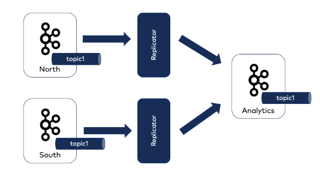
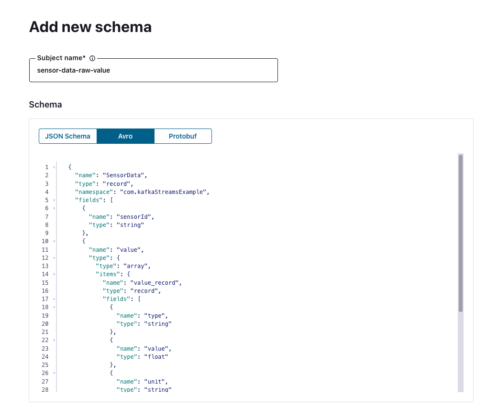

# Data Aggregation via Replicator

We would like to run [Replicator](https://docs.confluent.io/platform/current/multi-dc-deployments/replicator/index.html) on several local Kafka clusters and replicate the data
into a central cluster on CC.
This repository serves as an example for **one** local cluster aggregation. 
However, this configuration was successfully tested for multiple local
Kafka clusters.

Also, we will run Replicator as an executable and data is emitted 
with an Avro format.



## Create Topic & Register Schema in CC

We first create the Kafka topic and register the schema in CC.

:warning: **Important:** The schema in CC and on all local Kafka clusters are decoupled,
meaning that schema evolution needs to be adjusted on all cluster manually.
We could think of using [Schema Linking](https://docs.confluent.io/platform/current/schema-registry/schema-linking-cp.html) to 
migrate schemas, but it would require to set up one
Schema Exporter per local Kafka cluster in CC because CC is assumed as the single
source of truth.



## Start the environment
We start a local Kafka cluster, a Schema Registry and Replicator as an executable
```
docker-compose up -d
```

## Produce Data locally
We produce data to the local Kafka cluster with an Avro schema.
The schema is created automatically on the local SR.

```
./gradlew run
```

We verify it is produced with a schema on the local Cluster
```shell
kafka-avro-console-consumer --bootstrap-server localhost:9092 --topic sensor-data-raw --property schema.registry.url="http://localhost:8081"
```

## Consume data in CC

We verify it is migrated with a schema also on CC

```shell
kafka-avro-console-consumer --bootstrap-server <CC Bootstrap Server> --consumer.config client.properties --topic sensor-data-raw --property schema.registry.url="<CC SR>" --property schema.registry.basic.auth.user.info="<API KEY: API SECRET>" --property basic.auth.credentials.source="USER_INFO"
```


## Important Notes

* Only configure the `--cluster.id` for each Replicator, no `client.id` or `group.id` when running Replicator as an executable.
* The internal topics (config, offset, status) will be created on the destination cluster. If you want to have the internal topics created on the source cluster we need to create the Replicator
  as a Connector.
* Do not sync the topic configuration.
* We connect the `src.value.converter` with the local SR, whereas the `value.converter` is connected to the CC SR.
* The used SA has full permissions, to restrict it following the least privilege guidance, see the corresponding [ACLs documentation](https://docs.confluent.io/platform/current/multi-dc-deployments/replicator/index.html#acls-to-write-to-the-destination-cluster)

For more information check out [replicator.properties](./Replicator/replicator.properties).
